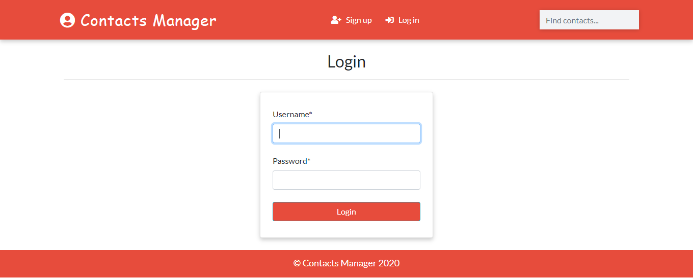

<h1 align="center">Contact-Manager-App-Django</h1>
<a href="#">
  <div align="center">
    
  </div>
</a>

## Functionalities
- [x] User Authentication
- [x] Search
- [x] Real Time Update from Admin
- [x] Delete
- [x] Filter according to gender
- [x] Profile Image


## How To Run
```
git clone https://github.com/saadhaxxan/Contact-Manager-Django.git
cd Contact-Manager-Django
python manage.py runserver
```
## Access to the Admin Panel
```
python manage.py createsuperuser
```

## Author
You can get in touch with me on my LinkedIn Profile:

#### Saad Hassan
[](https://www.linkedin.com/in/saadhaxxan)

You can also follow my GitHub Profile to stay updated about my latest projects: [](https://github.com/saadhaxxan)

If you liked the repo then kindly support it by giving it a star ⭐!
