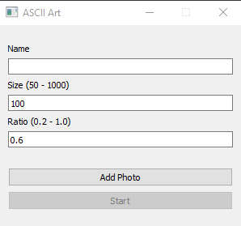

# Image-to-ASCII-Art
The title is self-explanatory.

# Requirements
- Pillow Module for Python3
- PyQt5 and PyQt-tools for Python3

```
pip install pillow
pip install pyqt5
pip install pyqt5-tools
```

# File to Run
- program.pyw

# Test
See test.txt file

# Program


# A Little Explanation
- Size: Bigger is better. The larger it is, the larger the image in the text file. Resolution also increases.
- Ratio: Smaller is better. This value is for the vertical length of the picture to be created not to be longer than normal.

# Best Settings
`Size: 1000  Ratio: 0.2`

`Size: 150  Ratio: 0.3`

# Important Note
The larger the size part, the larger the picture, and probably only a small part of the picture will be visible in the text file when it exceeds a certain value. ***Zoom out in your text editor to see the whole picture.***
