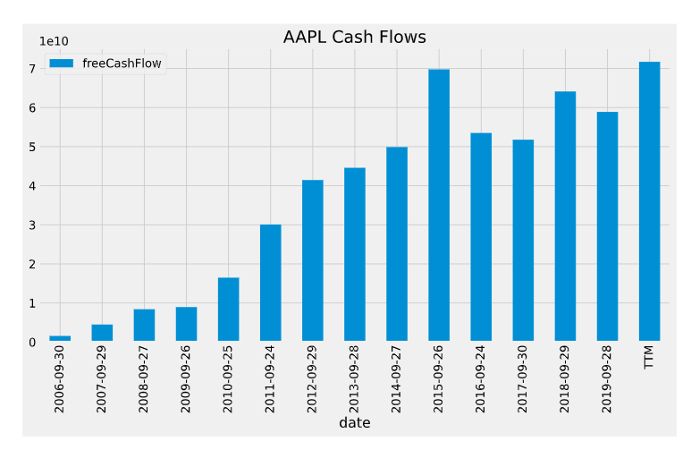
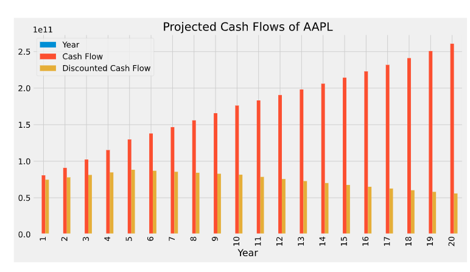
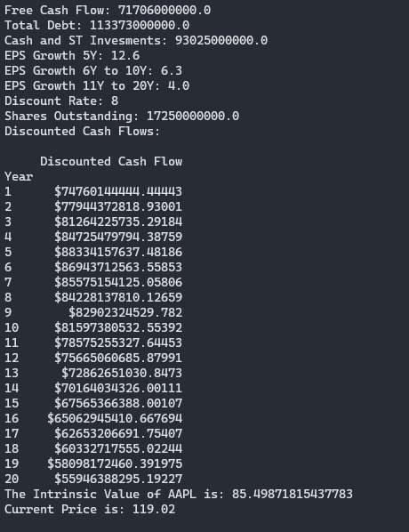
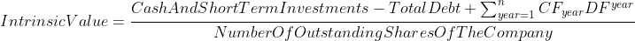

# Stock's Intrinsic Value

## 1. Table Of Contents
- [Stock's Intrinsic Value](#stocks-intrinsic-value)
  - [1. Table Of Contents](#1-table-of-contents)
  - [1.1. Visualization](#11-visualization)
  - [1.2. Stock Overview](#12-stock-overview)
  - [1.3. Tools](#13-tools)
  - [1.4. Resources](#14-resources)
  - [1.5. The Formula - How To Calculate The Intrinsic Value of A Stock](#15-the-formula---how-to-calculate-the-intrinsic-value-of-a-stock)
- [1.6. Usage](#16-usage)

## 1.1. Visualization




## 1.2. Stock Overview



## 1.3. Tools

* Pandas
* Numpy
* MatplotLib
* BeautifulSoup
* FMP API

## 1.4. Resources
* [How to Calculate Intrinsic Value of a Stock ](https://medium.com/datadriveninvestor/how-to-calculate-intrinsic-value-of-a-stock-aapl-case-study-935fb062004b// "ValueOfStock")
* [FinViz](https://finviz.com/)
* 


## 1.5. The Formula - How To Calculate The Intrinsic Value of A Stock



# 1.6. Usage
Go to [FMP Website](https://financialmodelingprep.com/developer), create an account and paste the API KEY you were given to line 26 and change the ticker to whatever stock you want hit **SAVE**.


Now open project's directory in *terminal* and run this:
```
pip3 install -r requirements.txt 
```

After Installtion is finished It's time to **RUN**:
```
Python3 stockValue.py
```


