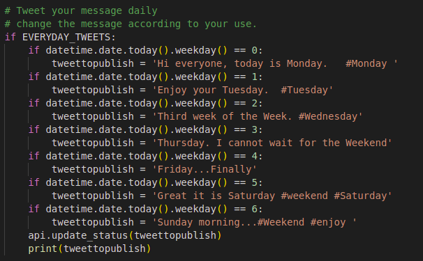
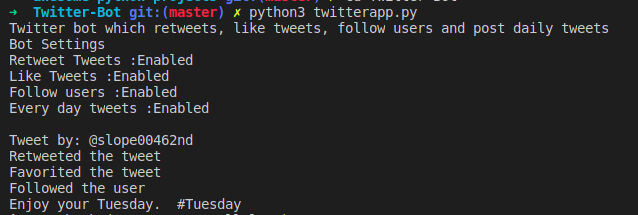

# Twitter-Bot

## Required Dependiencies
  - Python 3.5 or above
  - Tweepy
  - And [Twitter developer account](developers.twitter.com)
    - Get the Four keys from the developer account and update on the credientials.py file.
  
 ## Uses
  - You can search for a hashtag and like,retweet,follow the users who tweeted.
  - You can tweet on regularly basic by updating the format on the twitterapp.py file.
    
    
  
  - you can change your permissions by modifying config.py file.
  - Change the SLEEP_TIME in config.py file to your need.
  
 ## To run
  - Run the twitterapp.py file after updating the config.py and credientials.py file.
  
 ## Result
 
  
